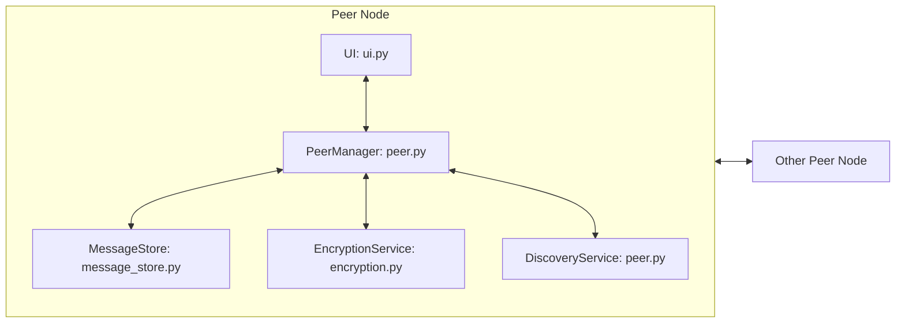

# Distributed System Architecture and Design (Assessment Appendix)

## Architectural Style
The system follows a decentralized peer-to-peer node architecture where each node contains UI, networking, persistence, and security modules. There is no centralized chat server.

## Component Model
Each peer node includes:
- UI layer (NiceGUI) for interaction and state presentation
- PeerManager for connection lifecycle and message routing
- DiscoveryService for UDP-based peer discovery
- MessageStore for local SQLite persistence
- EncryptionService for payload protection and graceful decrypt fallback

## Component Interaction Diagram

## Communication Model
- Data plane: TCP with length-prefixed JSON protocol for MESSAGE, HEARTBEAT, SYSTEM, TYPING frames
- Control/discovery plane: UDP broadcast beacons on discovery port
- Liveness plane: periodic heartbeats over existing TCP channels

### Why this model
- TCP ensures ordered and reliable chat payload delivery
- UDP beaconing reduces setup friction for LAN discovery
- Heartbeats enable fast failure detection and recovery

## Concurrency and Coordination Design
- Async event loop drives all network operations
- Per-peer reader tasks isolate connection I/O
- Shared mutable structures are protected with asyncio.Lock
- UI/network decoupling via asyncio.Queue

## Data and Consistency Design
- Local persistence at each node in SQLite for availability and history
- Eventual consistency suitable for chat semantics
- On reconnect, recent history and state are reconstructed from local storage and incoming streams

## Fault Tolerance Design
- Heartbeat timeout detection marks offline peers
- Exponential backoff reconnect for transient network failures
- Debounced system events prevent join/leave spam
- Node-local resilience: UI reload does not require centralized session state

## Security Design
- Symmetric encryption service integrated in message pipeline
- Graceful mismatch behavior to prevent crashes while signalling decrypt errors
- Secret handling via config/secret stores in deployment pipelines

## Deployment Model
### Local
- Multiple peer processes on different TCP ports
- Browser UI on derived web port per peer

### Cloud (AKS)
- Containerized app image
- Kubernetes Deployment + Service + HPA
- Health probes for readiness/liveness
- Azure Monitor integration through Log Analytics workspace

## Design Justification Matrix
| Design Decision | Alternative | Chosen Approach Justification |
|---|---|---|
| P2P node architecture | Centralized server | Matches distributed requirement and removes single point of failure |
| TCP for message transport | UDP-only messaging | Reliability and ordering are required for chat history correctness |
| UDP discovery | Manual-only peer setup | Improves usability while preserving decentralized operation |
| Local SQLite per peer | Shared central DB | Supports autonomy and eventual consistency model |
| Async I/O model | Thread-per-connection | Better scalability for many lightweight connections |
| Heartbeat + backoff | Passive timeout only | Faster detection and controlled reconnect behavior |

## Validation Evidence
- Architecture and protocol sections in README
- Runtime behavior in eval/smoke_p2p.py
- Kubernetes deployment manifests and CI deployment checks
- Terraform and Ansible automation artifacts
