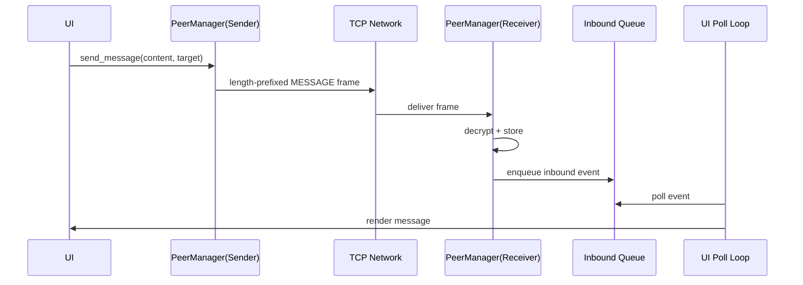
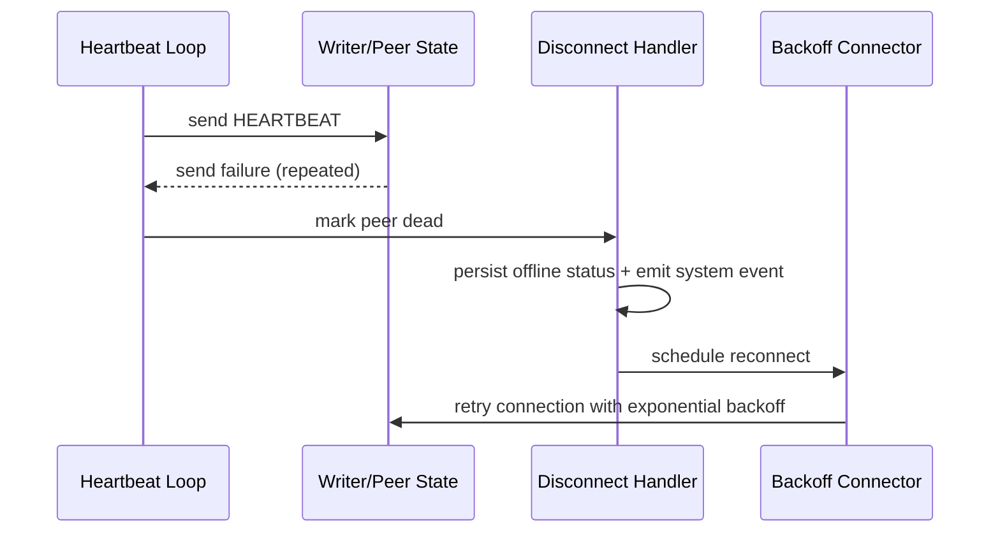

# Process, Communication, and Coordination (Assessment Appendix)

## Process Model
The application is process-distributed: each peer runs as an independent operating-system process with its own:
- UI session
- network listeners/connectors
- local persistence store
- runtime coordination state

No central process coordinates global state.

## IPC and Communication Mechanisms
### 1) Peer-to-peer message transport (TCP)
- Mechanism: asyncio StreamReader/StreamWriter over TCP
- Purpose: reliable ordered transport for chat payloads and control frames
- Frames: length-prefixed JSON with type-based dispatch (MESSAGE, HEARTBEAT, SYSTEM, TYPING)

### 2) Peer discovery (UDP broadcast)
- Mechanism: UDP beaconing on discovery port
- Purpose: LAN peer discovery without manual registration server
- Pattern: periodic HELLO beacon and listener callback scheduling

### 3) UI-network decoupling (intra-process queue)
- Mechanism: asyncio.Queue
- Purpose: decouple network receive path from UI polling/rendering loop
- Benefit: prevents UI blocking and reduces coupling between transport and presentation

## Synchronization and Coordination Design
### Shared state protection
- Primitive: asyncio.Lock
- Protected structures:
  - active writers map
  - peer metadata map
- Reason: avoid race conditions during connect/disconnect/send operations

### Concurrent task orchestration
- Primitive: asyncio task scheduling and gather/ensure_future patterns
- Coordinated loops:
  - TCP server accept loop
  - UDP broadcast loop
  - UDP listen loop
  - heartbeat loop
  - per-peer read loops

### Coordination events
- Join/leave system events are debounced to prevent repeated status noise
- Heartbeat failures trigger coordinated offline marking and reconnect scheduling
- Reconnect uses controlled exponential backoff to reduce thundering-retry behavior

## Efficiency Considerations
- Async I/O avoids thread-per-connection overhead
- Queue-based buffering smooths bursty inbound message handling
- Lock scope is kept narrow around shared dictionaries to reduce contention
- Heartbeat and discovery intervals balance freshness with network overhead

## Sequence Views
### A) Message Send and Receive

### B) Failure Detection and Recovery

## Verification Procedure (What to Demonstrate)
1. Start at least 2 peers and confirm bidirectional messaging.
2. Verify queue-driven UI updates without blocking.
3. Kill one peer and confirm:
- offline status update
- system event emission
- reconnect attempt behavior
4. Restore peer and confirm state recovery and continued message flow.

## Evidence Artifacts
- peer.py (network loops, lock/queue coordination, heartbeat, reconnect)
- ui.py (poll loop and state refresh)
- message_store.py (persist and retrieval flow)
- eval/smoke_p2p.py (runtime integration evidence)
