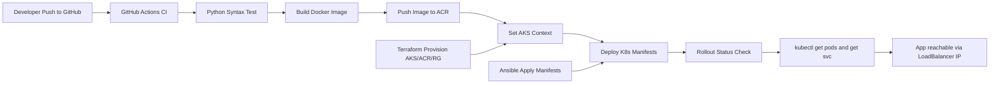

# End-to-End DevOps Submission Report

## Project Overview
This project implements an end-to-end DevOps pipeline for a Python web-based P2P chat application, including source control, containerization, IaC, configuration management, CI/CD, AKS deployment, and monitoring.

## Toolchain Used
- Git and GitHub
- GitHub Actions and Jenkins
- Docker
- Kubernetes on AKS
- Azure Cloud
- Terraform
- Ansible

## Phase-by-Phase Implementation

### Phase 1 Source Code and Version Control
Implemented:
- Python application code and modular architecture.
- Git repository initialized and pushed to GitHub.
- Branch and PR workflow documented.

Evidence:
- CONTRIBUTING.md
- .github/pull_request_template.md

### Phase 2 Containerization
Implemented:
- Dockerfile to build runtime image.
- Local orchestration via docker-compose.
- Automated push to ACR in CI.

Evidence:
- Dockerfile
- docker-compose.yml
- .github/workflows/ci-cd.yml

### Phase 3 Infrastructure Provisioning (IaC)
Implemented with Terraform:
- Azure Resource Group
- Azure Container Registry
- Azure Kubernetes Service
- Log Analytics Workspace (Azure Monitor integration)

Evidence:
- infra/terraform/main.tf
- infra/terraform/variables.tf
- infra/terraform/outputs.tf

### Phase 4 Configuration Management
Implemented with Ansible:
- Automated kubectl apply for namespace, configmap, deployment, service, and HPA.

Evidence:
- ansible/site.yml

### Phase 5 CI/CD Pipeline Setup
Implemented:
- GitHub Actions: test, build, push, deploy.
- Jenkins alternative pipeline: build, push, deploy.
- Trigger on code push.
- Deployment verification with rollout status and resource listing.

Evidence:
- .github/workflows/ci-cd.yml
- Jenkinsfile

### Phase 6 Deployment and Validation
Implemented:
- AKS deployment through CI.
- Validation commands included:
  - kubectl get pods -n p2p-chat
  - kubectl get svc -n p2p-chat
- Application access via LoadBalancer external IP from service output.

### Phase 7 Documentation and Submission
Implemented:
- Pipeline and operations docs.
- Monitoring setup notes.
- Phase checklist and this report.

Evidence:
- DEVOPS_PIPELINE.md
- AZURE_MONITOR_SETUP.md
- PHASED_IMPLEMENTATION_CHECKLIST.md
- SUBMISSION_REPORT.md

## Pipeline and Infrastructure Flow

## Security and General Guidelines Compliance
- Credentials handled through GitHub Secrets and Jenkins Credentials.
- .gitignore prevents local databases, Terraform state, config.json, and caches from being committed.
- Naming conventions and indentation are consistent across IaC and pipeline files.
- PR template encourages structured collaboration.

## Expected Outcomes Achieved
- Real-world DevOps implementation demonstrated.
- Automation and cloud integration established.
- Hands-on CI/CD, IaC, orchestration, and monitoring workflow implemented.
